# Algorithm Curriculum Gantt

This repo currently implements 46 of 239 unique problems from the curriculum. Use this hierarchy to navigate from parts to chapters to sections, then into the linked algorithm pages that already exist in the site.

Chapters are grouped by part and compared as parallel timelines. Click a chapter bar to open its sections gantt. If Mermaid links are disabled in your renderer, use the chapter links below the chart.

```mermaid
%%{init: {"theme": "base", "themeCSS": ".grid .tick line { stroke: #000000; stroke-opacity: 0.14; stroke-width: 1; } .grid .tick text { fill: #000000; font-size: 13px; font-weight: 600; letter-spacing: 0.02em; font-family: -apple-system, BlinkMacSystemFont, \"SF Pro Text\", system-ui, sans-serif; transform: translateY(18px); } .grid + .grid .tick text { transform: translateY(-18px); } .grid path { stroke-width: 0; } .task { fill: #ffffff; stroke: #000000; stroke-width: 2; transform: translateY(8px); } .taskText, .taskTextOutsideRight, .taskTextOutsideLeft { fill: #000000; font-weight: 500; letter-spacing: 0.01em; transform: translateY(8px); } .milestone, .milestone path { fill: #000000 !important; stroke: #000000 !important; transform: translateY(8px); } .milestoneText { fill: #000000; font-style: italic; font-weight: 500; letter-spacing: 0.01em; transform: translateY(8px); } .section { opacity: 1 !important; stroke: none !important; } .sectionTitle { fill: #000000 !important; font-size: 15px !important; font-weight: 700; letter-spacing: 0.06em; text-transform: uppercase; } .today { stroke: #000000; stroke-opacity: 0.28; stroke-width: 1.5; } .taskText, .taskTextOutsideRight, .taskTextOutsideLeft { font-size: 11px; } .sectionTitle { font-size: 14px !important; } .taskTextOutsideRight, .taskTextOutsideLeft { display: none; }", "themeVariables": {"background": "#ffffff", "mainBkg": "#ffffff", "primaryColor": "#ffffff", "primaryBorderColor": "#000000", "primaryTextColor": "#000000", "textColor": "#000000", "titleColor": "#000000", "lineColor": "#000000", "secondaryColor": "#ffffff", "tertiaryColor": "#ffffff", "sectionBkgColor": "#fbfbfd", "altSectionBkgColor": "#f5f5f7", "taskBkgColor": "#ffffff", "taskBorderColor": "#000000", "taskTextColor": "#000000", "taskTextDarkColor": "#000000", "taskTextOutsideColor": "#000000", "activeTaskBkgColor": "#ffffff", "activeTaskBorderColor": "#000000", "gridColor": "#000000", "todayLineColor": "#000000", "critBkgColor": "#000000", "critBorderColor": "#000000", "doneTaskBkgColor": "#ffffff", "doneTaskBorderColor": "#000000", "fontFamily": "\"SF Mono\", \"SFMono-Regular\", ui-monospace, Menlo, monospace", "fontSize": "11px"}, "gantt": {"useMaxWidth": false, "barHeight": 26, "barGap": 24, "topPadding": 104, "rightPadding": 72, "leftPadding": 240, "gridLineStartPadding": 20, "topAxis": true, "titleTopMargin": 0, "sectionFontSize": 15, "fontSize": 12, "numberSectionStyles": 2, "bottomMarginAdj": 0}}}%%
%% hierarchical curriculum gantt:
%% root = chapters, chapter pages = sections, section pages = problems
gantt
    dateFormat YYYY-MM-DD
    axisFormat %b '%y
    tickInterval 2month

    section Part I · Foundations
    Ch01 Arrays                        :ch01, 2026-04-06, 108d
    Ch02 Lists                         :ch02, 2026-04-06, 47d
    Ch03 Hash                          :crit, ch03, 2026-04-06, 43d
    Ch04 S/Q                           :crit, ch04, 2026-04-06, 45d
    Ch05 Sorted                        :crit, ch05, 2026-04-06, 27d
    GATE · part I mapped               :milestone, crit, mp05, after ch01 ch02 ch03 ch04 ch05, 0d

    section Part II · Boundaries
    Ch06 Prefix                        :crit, ch06, 2026-04-06, 18d
    Ch07 Window                        :crit, ch07, 2026-04-06, 29d
    Ch08 BSearch                       :ch08, 2026-04-06, 36d
    GATE · part II mapped              :milestone, crit, mp08, after ch06 ch07 ch08, 0d

    section Part III · Decomposition
    Ch09 Trees                         :ch09, 2026-04-06, 69d
    Ch10 BST/Trie                      :ch10, 2026-04-06, 31d
    Ch11 Memo                          :ch11, 2026-04-06, 21d
    Ch12 DP Table                      :crit, ch12, 2026-04-06, 40d
    GATE · part III mapped             :milestone, crit, mp12, after ch09 ch10 ch11 ch12, 0d

    section Part IV · Decisions
    Ch13 Graphs                        :crit, ch13, 2026-04-06, 44d
    Ch14 Heap/PQ                       :ch14, 2026-04-06, 30d
    Ch15 Greedy                        :crit, ch15, 2026-04-06, 19d
    Ch16 Backtrack                     :crit, ch16, 2026-04-06, 31d
    GATE · part IV mapped              :milestone, crit, mp16, after ch13 ch14 ch15 ch16, 0d

    section Appendices
    App A Bits                         :ch17, 2026-04-06, 19d
    App B Math                         :ch18, 2026-04-06, 22d
    GATE · appendices mapped           :milestone, crit, mp18, after ch17 ch18, 0d

    END · chapter map complete        :milestone, crit, mend, after mp05 mp08 mp12 mp16 mp18, 0d

    click ch01 href "./chapters/ch01-array-and-string-mechanics.md"
    click ch02 href "./chapters/ch02-linked-lists-pointer-mechanics.md"
    click ch03 href "./chapters/ch03-the-hash-map-trading-memory-for-answers.md"
    click ch04 href "./chapters/ch04-stacks-queues-and-monotonic-structures.md"
    click ch05 href "./chapters/ch05-sorting-two-pointers-and-intervals.md"
    click ch06 href "./chapters/ch06-prefix-sums-and-kadane-s-algorithm.md"
    click ch07 href "./chapters/ch07-the-sliding-window.md"
    click ch08 href "./chapters/ch08-binary-search-decision-boundaries.md"
    click ch09 href "./chapters/ch09-recursion-and-binary-trees.md"
    click ch10 href "./chapters/ch10-bst-tries-and-divide-and-conquer.md"
    click ch11 href "./chapters/ch11-dynamic-programming-i-memoization.md"
    click ch12 href "./chapters/ch12-dynamic-programming-ii-tabulation-and-state-machines.md"
    click ch13 href "./chapters/ch13-graphs-traversal-bfs-and-topological-order.md"
    click ch14 href "./chapters/ch14-heaps-and-priority-queues.md"
    click ch15 href "./chapters/ch15-greedy-algorithms.md"
    click ch16 href "./chapters/ch16-backtracking.md"
    click ch17 href "./chapters/app-a-bit-manipulation.md"
    click ch18 href "./chapters/app-b-mathematical-reasoning.md"
```

## Part Timelines

### Part I · Foundations

5 chapters · 11 sections · 30 groupings · 45/102 implemented · Apr 6, 2026 -> Jul 22, 2026

- [Chapter 01 — Array and String Mechanics](./chapters/ch01-array-and-string-mechanics.md) · 4 sections · 12 groupings · 43 problems · 43/43 implemented · Apr 6, 2026 -> Jul 22, 2026
- [Chapter 02 — Linked Lists — Pointer Mechanics](./chapters/ch02-linked-lists-pointer-mechanics.md) · 1 section · 3 groupings · 16 problems · 1/16 implemented · Apr 6, 2026 -> May 22, 2026
- [Chapter 03 — The Hash Map — Trading Memory for Answers](./chapters/ch03-the-hash-map-trading-memory-for-answers.md) · 1 section · 3 groupings · 18 problems · 1/18 implemented · Apr 6, 2026 -> May 18, 2026
- [Chapter 04 — Stacks, Queues, and Monotonic Structures](./chapters/ch04-stacks-queues-and-monotonic-structures.md) · 3 sections · 7 groupings · 15 problems · 0/15 implemented · Apr 6, 2026 -> May 20, 2026
- [Chapter 05 — Sorting, Two Pointers, and Intervals](./chapters/ch05-sorting-two-pointers-and-intervals.md) · 2 sections · 5 groupings · 10 problems · 0/10 implemented · Apr 6, 2026 -> May 2, 2026

### Part II · Boundaries

3 chapters · 3 sections · 9 groupings · 1/28 implemented · Apr 6, 2026 -> May 11, 2026

- [Chapter 06 — Prefix Sums and Kadane's Algorithm](./chapters/ch06-prefix-sums-and-kadane-s-algorithm.md) · 1 section · 3 groupings · 6 problems · 0/6 implemented · Apr 6, 2026 -> Apr 23, 2026
- [Chapter 07 — The Sliding Window](./chapters/ch07-the-sliding-window.md) · 1 section · 3 groupings · 9 problems · 0/9 implemented · Apr 6, 2026 -> May 4, 2026
- [Chapter 08 — Binary Search — Decision Boundaries](./chapters/ch08-binary-search-decision-boundaries.md) · 1 section · 3 groupings · 13 problems · 1/13 implemented · Apr 6, 2026 -> May 11, 2026

### Part III · Decomposition

4 chapters · 8 sections · 18 groupings · 0/57 implemented · Apr 6, 2026 -> Jun 13, 2026

- [Chapter 09 — Recursion and Binary Trees](./chapters/ch09-recursion-and-binary-trees.md) · 2 sections · 4 groupings · 26 problems · 0/26 implemented · Apr 6, 2026 -> Jun 13, 2026
- [Chapter 10 — BST, Tries, and Divide & Conquer](./chapters/ch10-bst-tries-and-divide-and-conquer.md) · 3 sections · 6 groupings · 11 problems · 0/11 implemented · Apr 6, 2026 -> May 6, 2026
- [Chapter 11 — Dynamic Programming I — Memoization](./chapters/ch11-dynamic-programming-i-memoization.md) · 1 section · 3 groupings · 8 problems · 0/8 implemented · Apr 6, 2026 -> Apr 26, 2026
- [Chapter 12 — Dynamic Programming II — Tabulation and State Machines](./chapters/ch12-dynamic-programming-ii-tabulation-and-state-machines.md) · 2 sections · 5 groupings · 12 problems · 0/12 implemented · Apr 6, 2026 -> May 15, 2026

### Part IV · Decisions

4 chapters · 5 sections · 14 groupings · 0/37 implemented · Apr 6, 2026 -> May 19, 2026

- [Chapter 13 — Graphs — Traversal, BFS, and Topological Order](./chapters/ch13-graphs-traversal-bfs-and-topological-order.md) · 2 sections · 5 groupings · 14 problems · 0/14 implemented · Apr 6, 2026 -> May 19, 2026
- [Chapter 14 — Heaps and Priority Queues](./chapters/ch14-heaps-and-priority-queues.md) · 1 section · 3 groupings · 8 problems · 0/8 implemented · Apr 6, 2026 -> May 5, 2026
- [Chapter 15 — Greedy Algorithms](./chapters/ch15-greedy-algorithms.md) · 1 section · 3 groupings · 6 problems · 0/6 implemented · Apr 6, 2026 -> Apr 24, 2026
- [Chapter 16 — Backtracking](./chapters/ch16-backtracking.md) · 1 section · 3 groupings · 9 problems · 0/9 implemented · Apr 6, 2026 -> May 6, 2026

### Appendices

2 chapters · 2 sections · 5 groupings · 0/16 implemented · Apr 6, 2026 -> Apr 27, 2026

- [APPENDIX A: BIT MANIPULATION](./chapters/app-a-bit-manipulation.md) · 1 section · 2 groupings · 8 problems · 0/8 implemented · Apr 6, 2026 -> Apr 24, 2026
- [APPENDIX B: MATHEMATICAL REASONING](./chapters/app-b-mathematical-reasoning.md) · 1 section · 3 groupings · 8 problems · 0/8 implemented · Apr 6, 2026 -> Apr 27, 2026
