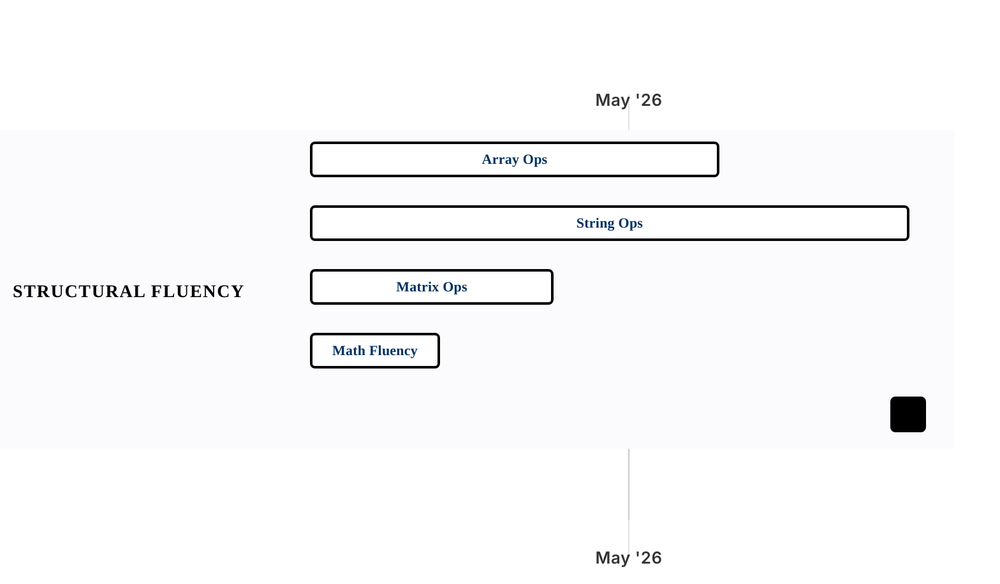

[← Back to Chapters Overview](../README.md)

# Chapter 01 — Array and String Mechanics

Within [Part I · Foundations](../README.md).

4 sections · 12 groupings · 43 problems · 43/43 implemented · Apr 6, 2026 -> Jul 22, 2026

Sections are compared as parallel timelines inside the chapter. Click a section bar to open its problem gantt. If Mermaid task links are disabled, use the section links below the chart.

## Section Timelines

### Array Operations — In-Place Transformation

[Open problem gantt](../sections/ch01-s01-array-operations-in-place-transformation.md) · 14 problems · 3 groupings · 14/14 implemented · Apr 6, 2026 -> May 7, 2026

Groupings: In-Place Rewrite; Array Invariants; Order/Check/Greedy

### String Operations — Parsing and Transformation

[Open problem gantt](../sections/ch01-s02-string-operations-parsing-and-transformation.md) · 17 problems · 4 groupings · 17/17 implemented · Apr 6, 2026 -> May 22, 2026

Groupings: Numeral & Binary; Scan & Compare; Rewrite & Normalize; Pattern & Validation

### Matrix Operations — 2D Traversal

[Open problem gantt](../sections/ch01-s03-matrix-operations-2d-traversal.md) · 7 problems · 3 groupings · 7/7 implemented · Apr 6, 2026 -> Apr 24, 2026

Groupings: Summaries & Traversal; Transforms & Markers; Constraint Simulation

### Mathematical Fluency

[Open problem gantt](../sections/ch01-s04-mathematical-fluency.md) · 5 problems · 2 groupings · 5/5 implemented · Apr 6, 2026 -> Apr 15, 2026

Groupings: Numeric Transforms; Movement & Simulation

[← Back to Chapters Overview](../README.md)
