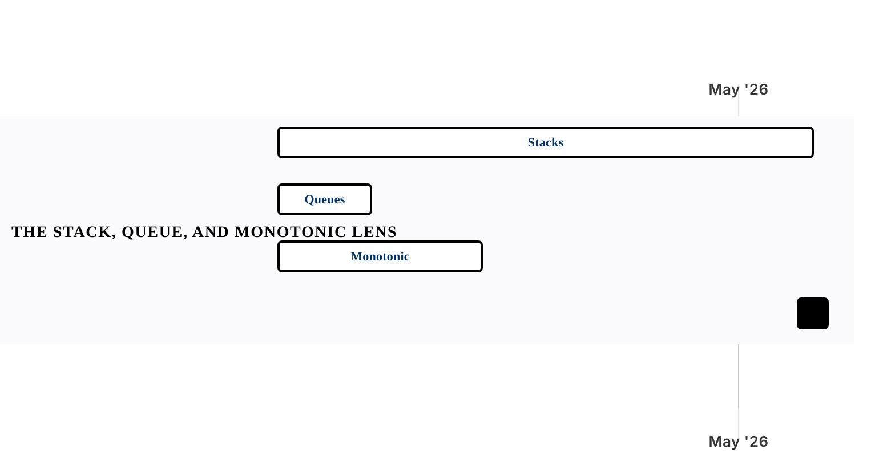

[← Back to Chapters Overview](../README.md)

# Chapter 04 — Stacks, Queues, and Monotonic Structures

Within [Part I · Foundations](../README.md).

3 sections · 7 groupings · 15 problems · 0/15 implemented · Apr 6, 2026 -> May 20, 2026

Sections are compared as parallel timelines inside the chapter. Click a section bar to open its problem gantt. If Mermaid task links are disabled, use the section links below the chart.

## Section Timelines

### Stacks — LIFO Processing

[Open problem gantt](../sections/ch04-s01-stacks-lifo-processing.md) · 10 problems · 3 groupings · 0/10 implemented · Apr 6, 2026 -> May 4, 2026

Groupings: Delimiters & Paths; Simulation Stacks; Emulation & Parsing

### Queues — FIFO Processing

[Open problem gantt](../sections/ch04-s02-queues-fifo-processing.md) · 2 problems · 2 groupings · 0/2 implemented · Apr 6, 2026 -> Apr 10, 2026

Groupings: Window Queue; Competitive Queue

### Monotonic Stacks — Aggressive Pruning

[Open problem gantt](../sections/ch04-s03-monotonic-stacks-aggressive-pruning.md) · 3 problems · 2 groupings · 0/3 implemented · Apr 6, 2026 -> Apr 16, 2026

Groupings: Next-Greater Patterns; Basin Computation

[← Back to Chapters Overview](../README.md)
