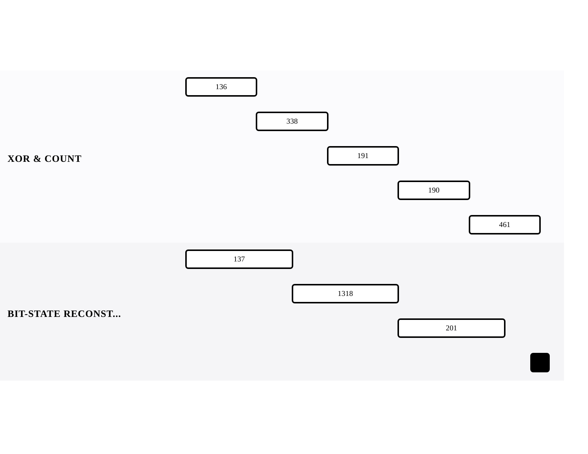

[← Back to APPENDIX A: BIT MANIPULATION](../chapters/app-a-bit-manipulation.md)

# Bit Manipulation Problems

Within [APPENDIX A: BIT MANIPULATION](../chapters/app-a-bit-manipulation.md).

8 problems · 2 groupings · 0/8 implemented · Apr 6, 2026 -> Apr 15, 2026

## Groupings

- XOR & Counting · 5 problems · Apr 6, 2026 -> Apr 15, 2026
- Bit-State Reconstruction · 3 problems · Apr 6, 2026 -> Apr 14, 2026

## Coverage

- Implemented in this repo: 0/8
- Published site index: [https://ideasbyrobert.github.io/algorithms/](https://ideasbyrobert.github.io/algorithms/)

## Problems by Group

### XOR & Counting

5 problems · Apr 6, 2026 -> Apr 15, 2026

- `136` Single Number · `E` · 2d · planned
- `338` Counting Bits · `E` · 2d · planned
- `191` Number of 1 Bits · `E` · 2d · planned
- `190` Reverse Bits · `E` · 2d · planned
- `461` Hamming Distance · `E` · 2d · planned

### Bit-State Reconstruction

3 problems · Apr 6, 2026 -> Apr 14, 2026

- `137` Single Number II · `M` · 3d · planned
- `1318` Minimum Flips to Make a OR b Equal to c · `M` · 3d · planned
- `201` Bitwise AND of Numbers Range · `M` · 3d · planned

[← Back to APPENDIX A: BIT MANIPULATION](../chapters/app-a-bit-manipulation.md)
