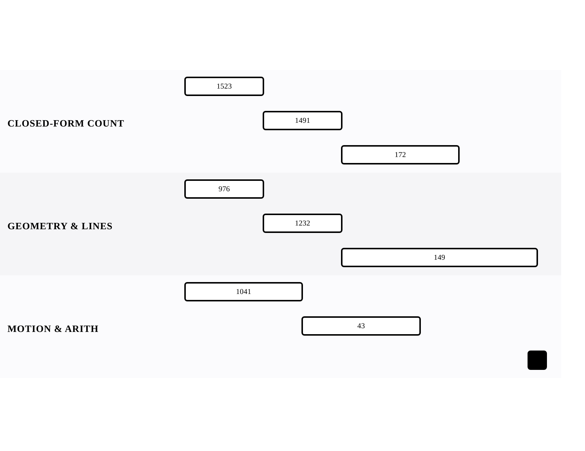

[← Back to APPENDIX B: MATHEMATICAL REASONING](../chapters/app-b-mathematical-reasoning.md)

# Mathematical Reasoning Problems

Within [APPENDIX B: MATHEMATICAL REASONING](../chapters/app-b-mathematical-reasoning.md).

8 problems · 3 groupings · 0/8 implemented · Apr 6, 2026 -> Apr 14, 2026

## Groupings

- Closed-Form Counting · 3 problems · Apr 6, 2026 -> Apr 12, 2026
- Geometry & Lines · 3 problems · Apr 6, 2026 -> Apr 14, 2026
- Motion & Arithmetic · 2 problems · Apr 6, 2026 -> Apr 11, 2026

## Coverage

- Implemented in this repo: 0/8
- Published site index: [https://ideasbyrobert.github.io/algorithms/](https://ideasbyrobert.github.io/algorithms/)

## Problems by Group

### Closed-Form Counting

3 problems · Apr 6, 2026 -> Apr 12, 2026

- `1523` Count Odd Numbers in an Interval Range · `E` · 2d · planned
- `1491` Average Salary Excluding Min and Max · `E` · 2d · planned
- `172` Factorial Trailing Zeroes · `M` · 3d · planned

### Geometry & Lines

3 problems · Apr 6, 2026 -> Apr 14, 2026

- `976` Largest Perimeter Triangle · `E` · 2d · planned
- `1232` Check If It Is a Straight Line · `E` · 2d · planned
- `149` Max Points on a Line · `H` · 5d · planned

### Motion & Arithmetic

2 problems · Apr 6, 2026 -> Apr 11, 2026

- `1041` Robot Bounded In Circle · `M` · 3d · planned
- `43` Multiply Strings · `M` · 3d · planned

[← Back to APPENDIX B: MATHEMATICAL REASONING](../chapters/app-b-mathematical-reasoning.md)
