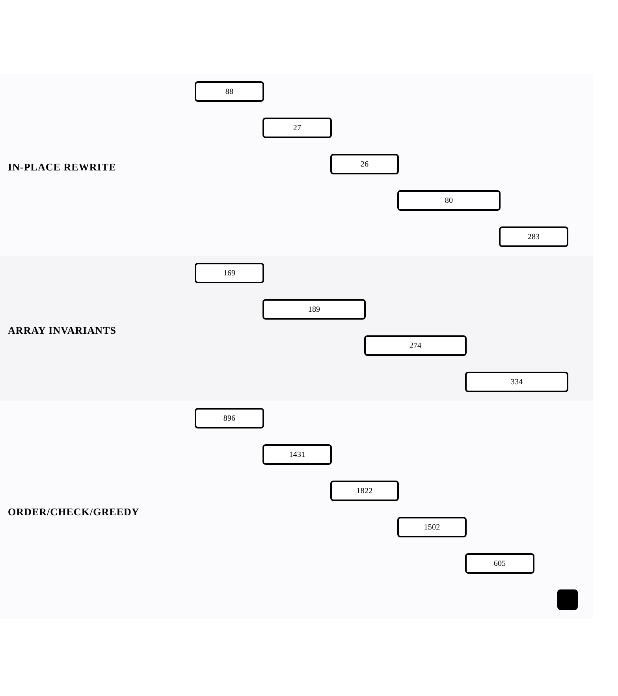

[← Back to Array and String Mechanics](../chapters/ch01-array-and-string-mechanics.md)

# Array Operations — In-Place Transformation

Within [Array and String Mechanics](../chapters/ch01-array-and-string-mechanics.md).

14 problems · 3 groupings · 14/14 implemented · Apr 6, 2026 -> Apr 16, 2026

## Groupings

- In-Place Rewrite · 5 problems · Apr 6, 2026 -> Apr 16, 2026
- Array Invariants · 4 problems · Apr 6, 2026 -> Apr 16, 2026
- Order/Check/Greedy · 5 problems · Apr 6, 2026 -> Apr 15, 2026

## Coverage

- Implemented in this repo: 14/14
- Published site index: [https://ideasbyrobert.github.io/algorithms/](https://ideasbyrobert.github.io/algorithms/)

## Problems by Group

### In-Place Rewrite

5 problems · Apr 6, 2026 -> Apr 16, 2026

- [`88` Merge Sorted Array](../../88-merge-sorted-array.html) · `E` · 2d · available
- [`27` Remove Element](../../27-remove-element.html) · `E` · 2d · available
- [`26` Remove Duplicates from Sorted Array](../../26-remove-duplicates-sorted-array.html) · `E` · 2d · available
- [`80` Remove Duplicates from Sorted Array II](../../80-remove-duplicates-sorted-array-ii.html) · `M` · 3d · available
- [`283` Move Zeroes](../../283-move-zeroes.html) · `E` · 2d · available

### Array Invariants

4 problems · Apr 6, 2026 -> Apr 16, 2026

- [`169` Majority Element](../../169-majority-element.html) · `E` · 2d · available
- [`189` Rotate Array](../../189-rotate-array.html) · `M` · 3d · available
- [`274` H-Index](../../274-hindex.html) · `M` · 3d · available
- [`334` Increasing Triplet Subsequence](../../334-increasing-triplet-subsequence.html) · `M` · 3d · available

### Order/Check/Greedy

5 problems · Apr 6, 2026 -> Apr 15, 2026

- [`896` Monotonic Array](../../896-monotonic-array.html) · `E` · 2d · available
- [`1431` Kids With the Greatest Number of Candies](../../1431-kids-candies.html) · `E` · 2d · available
- [`1822` Sign of the Product of an Array](../../1822-sign-of-product.html) · `E` · 2d · available
- [`1502` Can Make Arithmetic Progression](../../1502-arithmetic-progression.html) · `E` · 2d · available
- [`605` Can Place Flowers](../../605-can-place-flowers.html) · `E` · 2d · available

[← Back to Array and String Mechanics](../chapters/ch01-array-and-string-mechanics.md)
