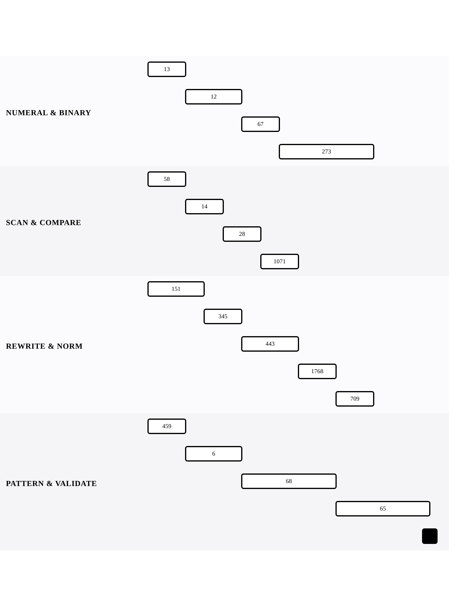

[← Back to Array and String Mechanics](../chapters/ch01-array-and-string-mechanics.md)

# String Operations — Parsing and Transformation

Within [Array and String Mechanics](../chapters/ch01-array-and-string-mechanics.md).

17 problems · 4 groupings · 17/17 implemented · Apr 6, 2026 -> Apr 20, 2026

## Groupings

- Numeral & Binary · 4 problems · Apr 6, 2026 -> Apr 17, 2026
- Scan & Compare · 4 problems · Apr 6, 2026 -> Apr 13, 2026
- Rewrite & Normalize · 5 problems · Apr 6, 2026 -> Apr 17, 2026
- Pattern & Validation · 4 problems · Apr 6, 2026 -> Apr 20, 2026

## Coverage

- Implemented in this repo: 17/17
- Published site index: [https://ideasbyrobert.github.io/algorithms/](https://ideasbyrobert.github.io/algorithms/)

## Problems by Group

### Numeral & Binary

4 problems · Apr 6, 2026 -> Apr 17, 2026

- [`13` Roman to Integer](../../13-roman-to-integer.html) · `E` · 2d · available
- [`12` Integer to Roman](../../12-integer-to-roman.html) · `M` · 3d · available
- [`67` Add Binary](../../67-add-binary.html) · `E` · 2d · available
- [`273` Integer to English Words](../../273-integer-to-english-words.html) · `H` · 5d · available

### Scan & Compare

4 problems · Apr 6, 2026 -> Apr 13, 2026

- [`58` Length of Last Word](../../58-length-of-last-word.html) · `E` · 2d · available
- [`14` Longest Common Prefix](../../14-longest-common-prefix.html) · `E` · 2d · available
- [`28` Find the Index of the First Occurrence](../../28-find-first-occurrence.html) · `E` · 2d · available
- [`1071` Greatest Common Divisor of Strings](../../1071-gcd-of-strings.html) · `E` · 2d · available

### Rewrite & Normalize

5 problems · Apr 6, 2026 -> Apr 17, 2026

- [`151` Reverse Words in a String](../../151-reverse-words.html) · `M` · 3d · available
- [`345` Reverse Vowels of a String](../../345-reverse-vowels.html) · `E` · 2d · available
- [`443` String Compression](../../443-string-compression.html) · `M` · 3d · available
- [`1768` Merge Strings Alternately](../../1768-merge-strings-alternately.html) · `E` · 2d · available
- [`709` To Lower Case](../../709-to-lower-case.html) · `E` · 2d · available

### Pattern & Validation

4 problems · Apr 6, 2026 -> Apr 20, 2026

- [`459` Repeated Substring Pattern](../../459-repeated-substring-pattern.html) · `E` · 2d · available
- [`6` Zigzag Conversion](../../6-zigzag-conversion.html) · `M` · 3d · available
- [`68` Text Justification](../../68-text-justification.html) · `H` · 5d · available
- [`65` Valid Number](../../65-valid-number.html) · `H` · 5d · available

[← Back to Array and String Mechanics](../chapters/ch01-array-and-string-mechanics.md)
