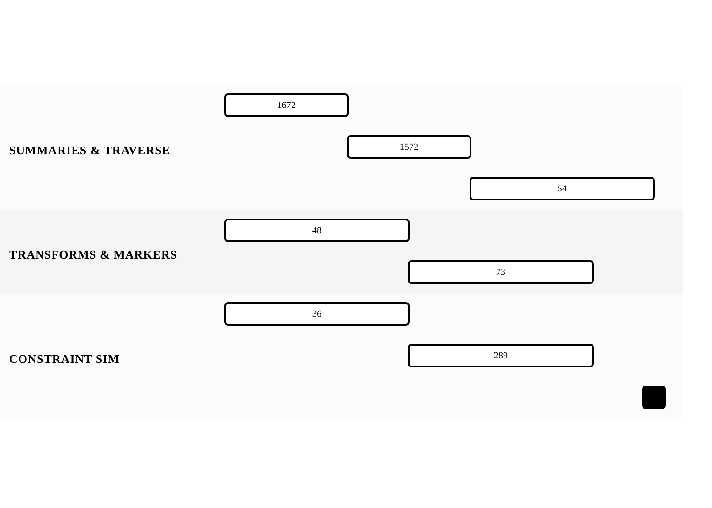

[← Back to Array and String Mechanics](../chapters/ch01-array-and-string-mechanics.md)

# Matrix Operations — 2D Traversal

Within [Array and String Mechanics](../chapters/ch01-array-and-string-mechanics.md).

7 problems · 3 groupings · 7/7 implemented · Apr 6, 2026 -> Apr 12, 2026

## Groupings

- Summaries & Traversal · 3 problems · Apr 6, 2026 -> Apr 12, 2026
- Transforms & Markers · 2 problems · Apr 6, 2026 -> Apr 11, 2026
- Constraint Simulation · 2 problems · Apr 6, 2026 -> Apr 11, 2026

## Coverage

- Implemented in this repo: 7/7
- Published site index: [https://ideasbyrobert.github.io/algorithms/](https://ideasbyrobert.github.io/algorithms/)

## Problems by Group

### Summaries & Traversal

3 problems · Apr 6, 2026 -> Apr 12, 2026

- [`1672` Richest Customer Wealth](../../1672-richest-customer-wealth.html) · `E` · 2d · available
- [`1572` Matrix Diagonal Sum](../../1572-matrix-diagonal-sum.html) · `E` · 2d · available
- [`54` Spiral Matrix](../../54-spiral-matrix.html) · `M` · 3d · available

### Transforms & Markers

2 problems · Apr 6, 2026 -> Apr 11, 2026

- [`48` Rotate Image](../../48-rotate-image.html) · `M` · 3d · available
- [`73` Set Matrix Zeroes](../../73-set-matrix-zeroes.html) · `M` · 3d · available

### Constraint Simulation

2 problems · Apr 6, 2026 -> Apr 11, 2026

- [`36` Valid Sudoku](../../36-valid-sudoku.html) · `M` · 3d · available
- [`289` Game of Life](../../289-game-of-life.html) · `M` · 3d · available

[← Back to Array and String Mechanics](../chapters/ch01-array-and-string-mechanics.md)
