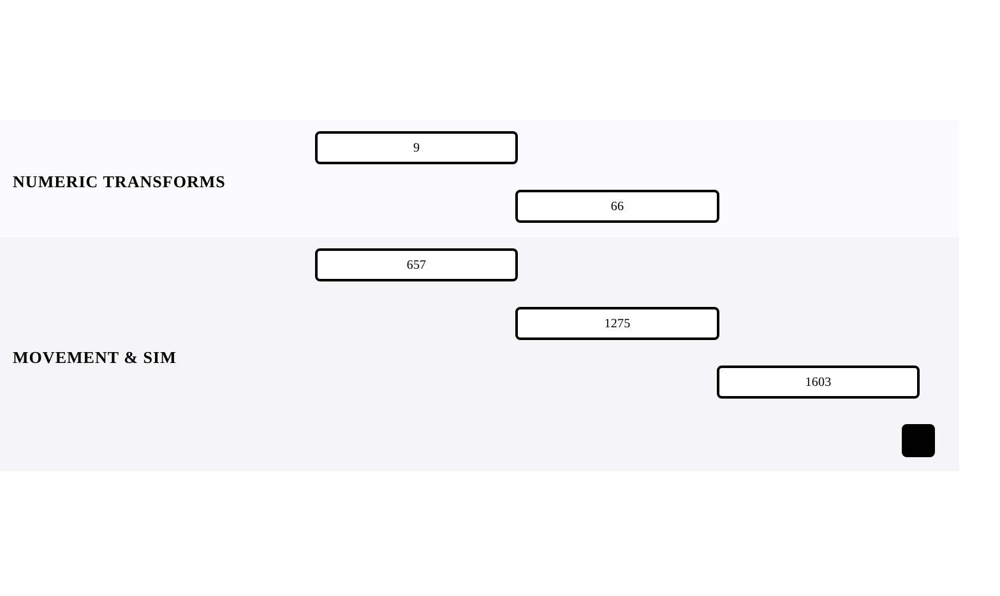

[← Back to Array and String Mechanics](../chapters/ch01-array-and-string-mechanics.md)

# Mathematical Fluency

Within [Array and String Mechanics](../chapters/ch01-array-and-string-mechanics.md).

5 problems · 2 groupings · 5/5 implemented · Apr 6, 2026 -> Apr 11, 2026

## Groupings

- Numeric Transforms · 2 problems · Apr 6, 2026 -> Apr 9, 2026
- Movement & Simulation · 3 problems · Apr 6, 2026 -> Apr 11, 2026

## Coverage

- Implemented in this repo: 5/5
- Published site index: [https://ideasbyrobert.github.io/algorithms/](https://ideasbyrobert.github.io/algorithms/)

## Problems by Group

### Numeric Transforms

2 problems · Apr 6, 2026 -> Apr 9, 2026

- [`9` Palindrome Number](../../9-palindrome-number.html) · `E` · 2d · available
- [`66` Plus One](../../66-plus-one.html) · `E` · 2d · available

### Movement & Simulation

3 problems · Apr 6, 2026 -> Apr 11, 2026

- [`657` Robot Return to Origin](../../657-robot-return-to-origin.html) · `E` · 2d · available
- [`1275` Find Winner on Tic Tac Toe](../../1275-tic-tac-toe-winner.html) · `E` · 2d · available
- [`1603` Design Parking System](../../1603-design-parking-system.html) · `E` · 2d · available

[← Back to Array and String Mechanics](../chapters/ch01-array-and-string-mechanics.md)
