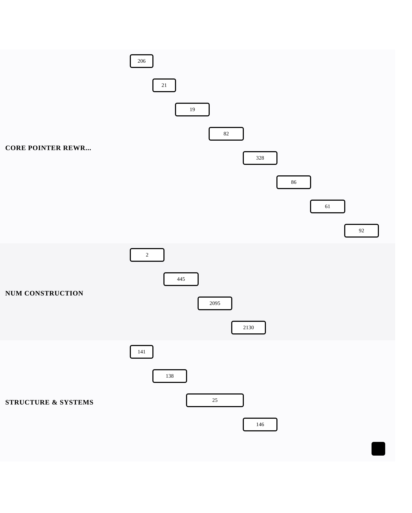

[← Back to Linked Lists — Pointer Mechanics](../chapters/ch02-linked-lists-pointer-mechanics.md)

# Pointer Fluency

Within [Linked Lists — Pointer Mechanics](../chapters/ch02-linked-lists-pointer-mechanics.md).

16 problems · 3 groupings · 1/16 implemented · Apr 6, 2026 -> Apr 27, 2026

## Groupings

- Core Pointer Rewrites · 8 problems · Apr 6, 2026 -> Apr 27, 2026
- Number Construction · 4 problems · Apr 6, 2026 -> Apr 17, 2026
- Structure & Systems · 4 problems · Apr 6, 2026 -> Apr 18, 2026

## Coverage

- Implemented in this repo: 1/16
- Published site index: [https://ideasbyrobert.github.io/algorithms/](https://ideasbyrobert.github.io/algorithms/)

## Problems by Group

### Core Pointer Rewrites

8 problems · Apr 6, 2026 -> Apr 27, 2026

- [`206` Reverse Linked List](../../206-reverse-linked-list.html) · `E` · 2d · available
- `21` Merge Two Sorted Lists · `E` · 2d · planned
- `19` Remove Nth Node From End of List · `M` · 3d · planned
- `82` Remove Duplicates from Sorted List II · `M` · 3d · planned
- `328` Odd Even Linked List · `M` · 3d · planned
- `86` Partition List · `M` · 3d · planned
- `61` Rotate List · `M` · 3d · planned
- `92` Reverse Linked List II · `M` · 3d · planned

### Number Construction

4 problems · Apr 6, 2026 -> Apr 17, 2026

- `2` Add Two Numbers · `M` · 3d · planned
- `445` Add Two Numbers II · `M` · 3d · planned
- `2095` Delete the Middle Node of a Linked List · `M` · 3d · planned
- `2130` Maximum Twin Sum of a Linked List · `M` · 3d · planned

### Structure & Systems

4 problems · Apr 6, 2026 -> Apr 18, 2026

- `141` Linked List Cycle · `E` · 2d · planned
- `138` Copy List with Random Pointer · `M` · 3d · planned
- `25` Reverse Nodes in k-Group · `H` · 5d · planned
- `146` LRU Cache · `M` · 3d · planned

[← Back to Linked Lists — Pointer Mechanics](../chapters/ch02-linked-lists-pointer-mechanics.md)
