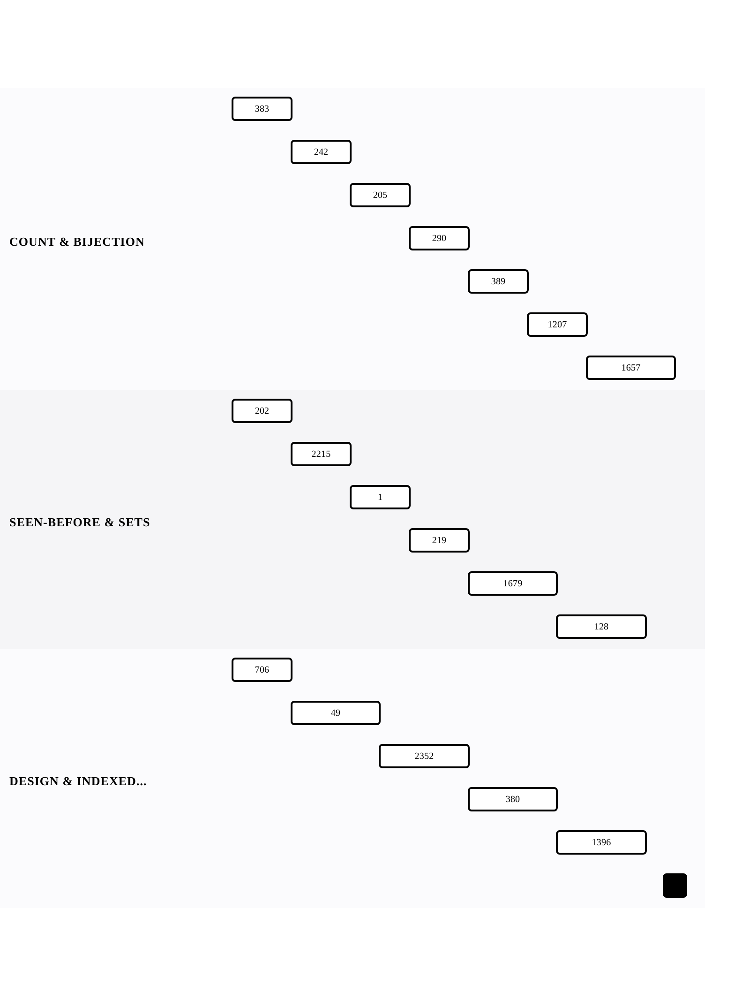

[← Back to The Hash Map — Trading Memory for Answers](../chapters/ch03-the-hash-map-trading-memory-for-answers.md)

# The Hash Map Lens

Within [The Hash Map — Trading Memory for Answers](../chapters/ch03-the-hash-map-trading-memory-for-answers.md).

18 problems · 3 groupings · 1/18 implemented · Apr 6, 2026 -> Apr 20, 2026

## Groupings

- Counting & Bijection · 7 problems · Apr 6, 2026 -> Apr 20, 2026
- Seen-Before & Sets · 6 problems · Apr 6, 2026 -> Apr 19, 2026
- Design & Indexed Lookup · 5 problems · Apr 6, 2026 -> Apr 19, 2026

## Coverage

- Implemented in this repo: 1/18
- Published site index: [https://ideasbyrobert.github.io/algorithms/](https://ideasbyrobert.github.io/algorithms/)

## Problems by Group

### Counting & Bijection

7 problems · Apr 6, 2026 -> Apr 20, 2026

- `383` Ransom Note · `E` · 2d · planned
- `242` Valid Anagram · `E` · 2d · planned
- `205` Isomorphic Strings · `E` · 2d · planned
- `290` Word Pattern · `E` · 2d · planned
- `389` Find the Difference · `E` · 2d · planned
- `1207` Unique Number of Occurrences · `E` · 2d · planned
- `1657` Determine if Two Strings Are Close · `M` · 3d · planned

### Seen-Before & Sets

6 problems · Apr 6, 2026 -> Apr 19, 2026

- `202` Happy Number · `E` · 2d · planned
- `2215` Find the Difference of Two Arrays · `E` · 2d · planned
- [`1` Two Sum](../../1-two-sum.html) · `E` · 2d · available ★
- `219` Contains Duplicate II · `E` · 2d · planned
- `1679` Max Number of K-Sum Pairs · `M` · 3d · planned
- `128` Longest Consecutive Sequence · `M` · 3d · planned

### Design & Indexed Lookup

5 problems · Apr 6, 2026 -> Apr 19, 2026

- `706` Design HashMap · `E` · 2d · planned
- `49` Group Anagrams · `M` · 3d · planned
- `2352` Equal Row and Column Pairs · `M` · 3d · planned
- `380` Insert Delete GetRandom O(1) · `M` · 3d · planned
- `1396` Design Underground System · `M` · 3d · planned

[← Back to The Hash Map — Trading Memory for Answers](../chapters/ch03-the-hash-map-trading-memory-for-answers.md)
