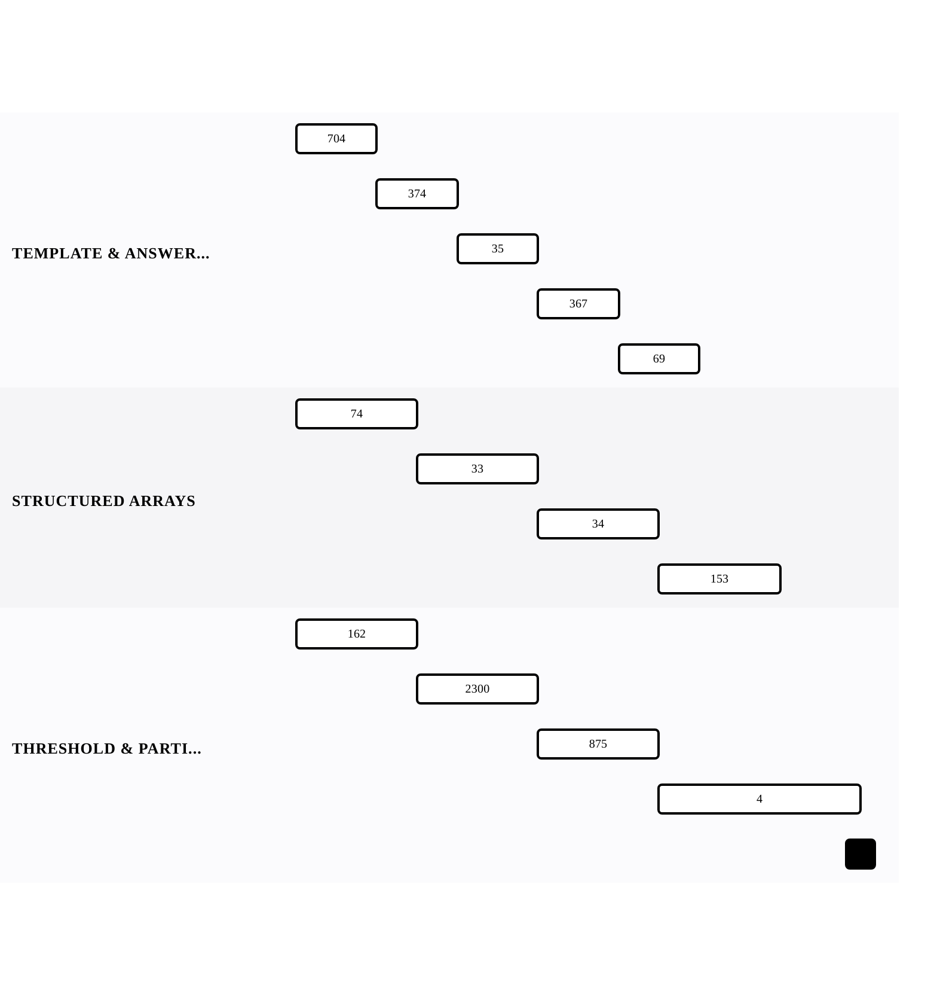

[← Back to Binary Search — Decision Boundaries](../chapters/ch08-binary-search-decision-boundaries.md)

# The Binary Search Lens

Within [Binary Search — Decision Boundaries](../chapters/ch08-binary-search-decision-boundaries.md).

13 problems · 3 groupings · 1/13 implemented · Apr 6, 2026 -> Apr 19, 2026

## Groupings

- Template & Answer Space · 5 problems · Apr 6, 2026 -> Apr 15, 2026
- Structured Arrays · 4 problems · Apr 6, 2026 -> Apr 17, 2026
- Threshold & Partition · 4 problems · Apr 6, 2026 -> Apr 19, 2026

## Coverage

- Implemented in this repo: 1/13
- Published site index: [https://ideasbyrobert.github.io/algorithms/](https://ideasbyrobert.github.io/algorithms/)

## Problems by Group

### Template & Answer Space

5 problems · Apr 6, 2026 -> Apr 15, 2026

- [`704` Binary Search](../../704-binary-search.html) · `E` · 2d · available
- `374` Guess Number Higher or Lower · `E` · 2d · planned
- `35` Search Insert Position · `E` · 2d · planned
- `367` Valid Perfect Square · `E` · 2d · planned
- `69` Sqrt(x) · `E` · 2d · planned

### Structured Arrays

4 problems · Apr 6, 2026 -> Apr 17, 2026

- `74` Search a 2D Matrix · `M` · 3d · planned
- `33` Search in Rotated Sorted Array · `M` · 3d · planned
- `34` Find First and Last Position · `M` · 3d · planned
- `153` Find Minimum in Rotated Sorted Array · `M` · 3d · planned

### Threshold & Partition

4 problems · Apr 6, 2026 -> Apr 19, 2026

- `162` Find Peak Element · `M` · 3d · planned
- `2300` Successful Pairs of Spells and Potions · `M` · 3d · planned
- `875` Koko Eating Bananas · `M` · 3d · planned
- `4` Median of Two Sorted Arrays · `H` · 5d · planned

[← Back to Binary Search — Decision Boundaries](../chapters/ch08-binary-search-decision-boundaries.md)
