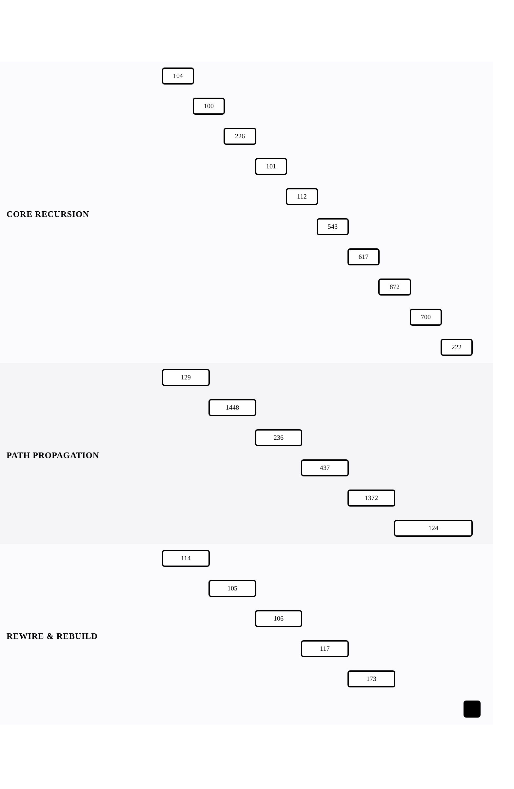

[← Back to Recursion and Binary Trees](../chapters/ch09-recursion-and-binary-trees.md)

# Recursive Structure

Within [Recursion and Binary Trees](../chapters/ch09-recursion-and-binary-trees.md).

21 problems · 3 groupings · 0/21 implemented · Apr 6, 2026 -> Apr 25, 2026

## Groupings

- Core Recursion · 10 problems · Apr 6, 2026 -> Apr 25, 2026
- Path Propagation · 6 problems · Apr 6, 2026 -> Apr 25, 2026
- Rewire & Rebuild · 5 problems · Apr 6, 2026 -> Apr 20, 2026

## Coverage

- Implemented in this repo: 0/21
- Published site index: [https://ideasbyrobert.github.io/algorithms/](https://ideasbyrobert.github.io/algorithms/)

## Problems by Group

### Core Recursion

10 problems · Apr 6, 2026 -> Apr 25, 2026

- `104` Maximum Depth of Binary Tree · `E` · 2d · planned
- `100` Same Tree · `E` · 2d · planned
- `226` Invert Binary Tree · `E` · 2d · planned
- `101` Symmetric Tree · `E` · 2d · planned
- `112` Path Sum · `E` · 2d · planned
- `543` Diameter of Binary Tree · `E` · 2d · planned
- `617` Merge Two Binary Trees · `E` · 2d · planned
- `872` Leaf-Similar Trees · `E` · 2d · planned
- `700` Search in a Binary Search Tree · `E` · 2d · planned
- `222` Count Complete Tree Nodes · `E` · 2d · planned

### Path Propagation

6 problems · Apr 6, 2026 -> Apr 25, 2026

- `129` Sum Root to Leaf Numbers · `M` · 3d · planned
- `1448` Count Good Nodes in Binary Tree · `M` · 3d · planned
- `236` Lowest Common Ancestor · `M` · 3d · planned
- `437` Path Sum III · `M` · 3d · planned
- `1372` Longest ZigZag Path in Binary Tree · `M` · 3d · planned
- `124` Binary Tree Maximum Path Sum · `H` · 5d · planned

### Rewire & Rebuild

5 problems · Apr 6, 2026 -> Apr 20, 2026

- `114` Flatten Binary Tree to Linked List · `M` · 3d · planned
- `105` Construct from Preorder and Inorder · `M` · 3d · planned
- `106` Construct from Inorder and Postorder · `M` · 3d · planned
- `117` Populating Next Right Pointers II · `M` · 3d · planned
- `173` BST Iterator · `M` · 3d · planned

[← Back to Recursion and Binary Trees](../chapters/ch09-recursion-and-binary-trees.md)
