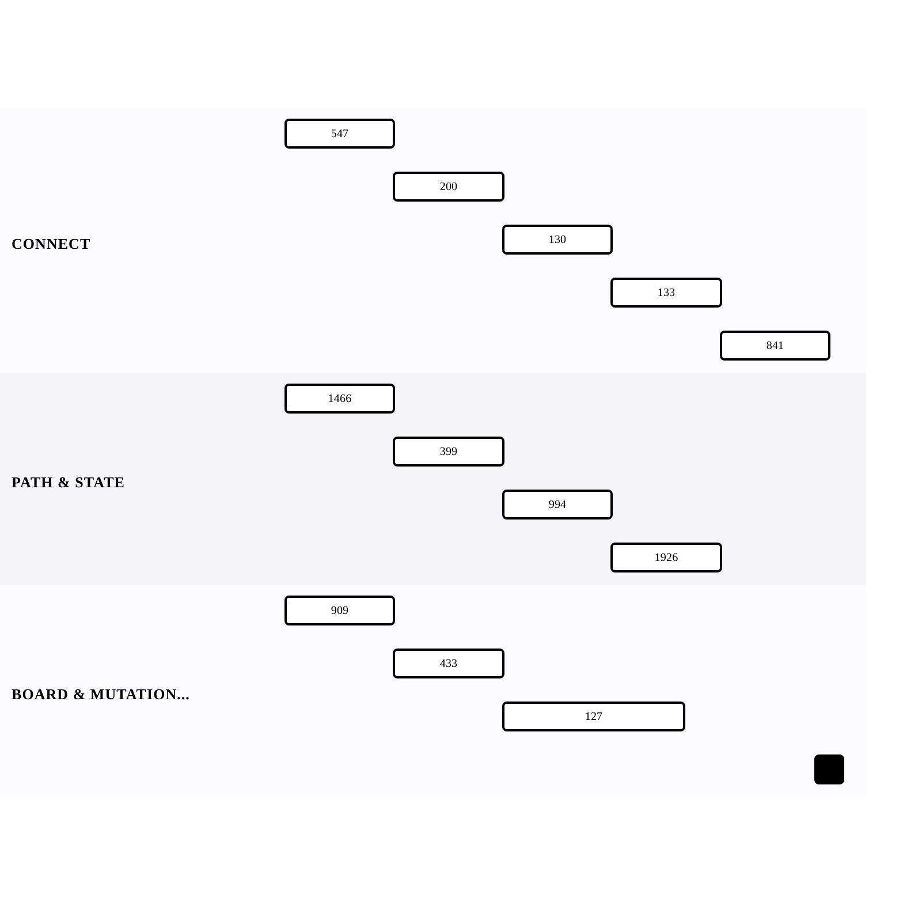

[← Back to Graphs — Traversal, BFS, and Topological Order](../chapters/ch13-graphs-traversal-bfs-and-topological-order.md)

# DFS/BFS Traversal

Within [Graphs — Traversal, BFS, and Topological Order](../chapters/ch13-graphs-traversal-bfs-and-topological-order.md).

12 problems · 3 groupings · 0/12 implemented · Apr 6, 2026 -> Apr 20, 2026

## Groupings

- Connectivity · 5 problems · Apr 6, 2026 -> Apr 20, 2026
- Path & State · 4 problems · Apr 6, 2026 -> Apr 17, 2026
- Board & Mutation Search · 3 problems · Apr 6, 2026 -> Apr 16, 2026

## Coverage

- Implemented in this repo: 0/12
- Published site index: [https://ideasbyrobert.github.io/algorithms/](https://ideasbyrobert.github.io/algorithms/)

## Problems by Group

### Connectivity

5 problems · Apr 6, 2026 -> Apr 20, 2026

- `547` Number of Provinces · `M` · 3d · planned
- `200` Number of Islands · `M` · 3d · planned
- `130` Surrounded Regions · `M` · 3d · planned
- `133` Clone Graph · `M` · 3d · planned
- `841` Keys and Rooms · `M` · 3d · planned

### Path & State

4 problems · Apr 6, 2026 -> Apr 17, 2026

- `1466` Reorder Routes to Make All Paths Lead to City Zero · `M` · 3d · planned
- `399` Evaluate Division · `M` · 3d · planned
- `994` Rotting Oranges · `M` · 3d · planned
- `1926` Nearest Exit from Entrance in Maze · `M` · 3d · planned

### Board & Mutation Search

3 problems · Apr 6, 2026 -> Apr 16, 2026

- `909` Snakes and Ladders · `M` · 3d · planned
- `433` Minimum Genetic Mutation · `M` · 3d · planned
- `127` Word Ladder · `H` · 5d · planned

[← Back to Graphs — Traversal, BFS, and Topological Order](../chapters/ch13-graphs-traversal-bfs-and-topological-order.md)
