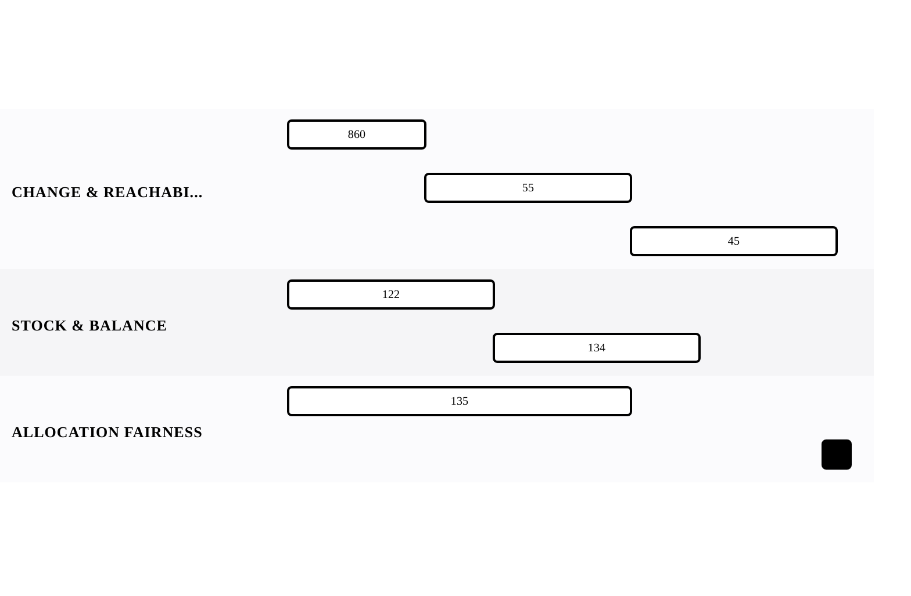

[← Back to Greedy Algorithms](../chapters/ch15-greedy-algorithms.md)

# The Greedy Lens

Within [Greedy Algorithms](../chapters/ch15-greedy-algorithms.md).

6 problems · 3 groupings · 0/6 implemented · Apr 6, 2026 -> Apr 13, 2026

## Groupings

- Change & Reachability · 3 problems · Apr 6, 2026 -> Apr 13, 2026
- Stock & Balance · 2 problems · Apr 6, 2026 -> Apr 11, 2026
- Allocation Fairness · 1 problem · Apr 6, 2026 -> Apr 10, 2026

## Coverage

- Implemented in this repo: 0/6
- Published site index: [https://ideasbyrobert.github.io/algorithms/](https://ideasbyrobert.github.io/algorithms/)

## Problems by Group

### Change & Reachability

3 problems · Apr 6, 2026 -> Apr 13, 2026

- `860` Lemonade Change · `E` · 2d · planned
- `55` Jump Game · `M` · 3d · planned
- `45` Jump Game II · `M` · 3d · planned

### Stock & Balance

2 problems · Apr 6, 2026 -> Apr 11, 2026

- `122` Best Time to Buy/Sell Stock II · `M` · 3d · planned ★
- `134` Gas Station · `M` · 3d · planned

### Allocation Fairness

1 problem · Apr 6, 2026 -> Apr 10, 2026

- `135` Candy · `H` · 5d · planned

[← Back to Greedy Algorithms](../chapters/ch15-greedy-algorithms.md)
