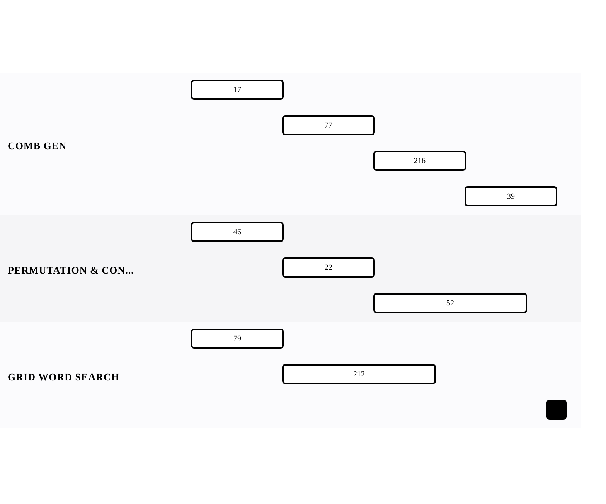

[← Back to Backtracking](../chapters/ch16-backtracking.md)

# The Backtracking Lens

Within [Backtracking](../chapters/ch16-backtracking.md).

9 problems · 3 groupings · 0/9 implemented · Apr 6, 2026 -> Apr 17, 2026

## Groupings

- Combination Generation · 4 problems · Apr 6, 2026 -> Apr 17, 2026
- Permutation & Constraints · 3 problems · Apr 6, 2026 -> Apr 16, 2026
- Grid Word Search · 2 problems · Apr 6, 2026 -> Apr 13, 2026

## Coverage

- Implemented in this repo: 0/9
- Published site index: [https://ideasbyrobert.github.io/algorithms/](https://ideasbyrobert.github.io/algorithms/)

## Problems by Group

### Combination Generation

4 problems · Apr 6, 2026 -> Apr 17, 2026

- `17` Letter Combinations of a Phone Number · `M` · 3d · planned
- `77` Combinations · `M` · 3d · planned
- `216` Combination Sum III · `M` · 3d · planned
- `39` Combination Sum · `M` · 3d · planned

### Permutation & Constraints

3 problems · Apr 6, 2026 -> Apr 16, 2026

- `46` Permutations · `M` · 3d · planned
- `22` Generate Parentheses · `M` · 3d · planned
- `52` N-Queens II · `H` · 5d · planned

### Grid Word Search

2 problems · Apr 6, 2026 -> Apr 13, 2026

- `79` Word Search · `M` · 3d · planned ★
- `212` Word Search II · `H` · 5d · planned

[← Back to Backtracking](../chapters/ch16-backtracking.md)
